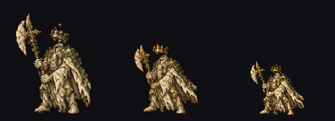

# Animatron

Batch sprite-sheet slicer + animation viewer for AI-generated character sheets.
Turns row-packed RGBA sheets into clean, planted animation loops — no manual
cutting, no quality loss.



## Quick start

Open `index.html` in a browser (double-click works — no server needed), then:

- **Drag a folder** of sprite sheets onto the page, or
- click **open folder** and pick the directory.

The sheets are sliced in-browser and the animation plays immediately.

## Expected sheet format

One PNG per animation group, named:

```
<Character> - <NN> <label>.png     e.g. "Crownless Sentinel - 01 core animation.png"
```

- RGBA with transparent background
- Frames packed in horizontal rows at a roughly constant pitch
- Each row becomes one clip (`· r1`, `· r2`, ...)
- Files group into characters by the `<Character>` prefix

## Viewer

- Searchable character list, per-clip chips
- Play / pause / fps / zoom, loop · once · ping-pong
- Filmstrip with per-frame seek — doubles as a QA pass
- Keyboard: space = play, arrows = step frames
- Checkerboard background toggle

## Batch pipeline (optional)

For large batches or persistent per-frame PNGs:

```bash
python3 -m venv .venv && .venv/bin/pip install pillow numpy scipy
.venv/bin/python tools/slice.py <sheets-dir> sprites.js
python3 -m http.server 8777    # then open http://localhost:8777/
```

Writes masked transparent PNGs to `frames/` and a `sprites.js` manifest the
viewer picks up automatically.

## How slicing works

1. Split rows on transparent horizontal bands
2. Recover frame pitch by autocorrelation of per-column alpha mass
   (works even where sprites touch edge-to-edge)
3. Global DP segmentation — cuts prefer real empty gaps, off-grid cuts penalized
4. Connected components labeled over the whole sheet; each *whole component*
   is assigned to the frame owning most of its mass (detached blades, crowns,
   dust travel intact — nothing is pixel-sliced mid-object)
5. Blobs wider than ~1.2 pitches (sprites literally fused) split at their
   thinnest column near the boundary — the "neck"
6. Per frame: masked crop to a transparent PNG + ground-contact anchor;
   anchor X is a least-squares fit over the row's cell grid so characters
   never slide

## Limitations

- Where two sprites physically overlap with zero empty pixels, a seam must
  exist somewhere — it is placed at the blob's neck, but a fragment can
  occasionally land a frame early or late
- The JS slicer runs in the main thread; very large folders slice one file
  at a time with a progress indicator

## License

MIT — see [LICENSE](LICENSE).
